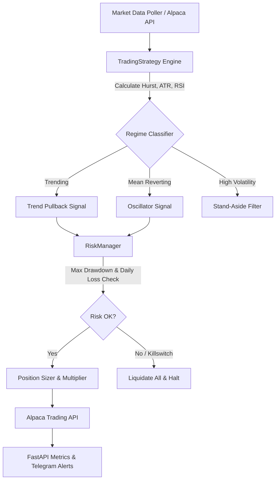

# Apex Oracle Bot 🤖⚡

Modern, high-frequency quantitative trading bot for crypto assets utilizing **Polars** dynamic market regime classification (Hurst Exponent, ATR, RSI), automated risk management with hard drawdown limits, and high-performance async order execution via Alpaca.

---

## 📐 Architecture Diagram



---

## 🚀 Quickstart Guide

### 1. Prerequisites
- **Python**: `>= 3.12`
- **Alpaca Trading Account** (Paper or Live API keys)
- **uv** / **pip** package manager

### 2. Environment Setup
Copy `.env.example` to `.env` and fill in your configuration:
```bash
cp .env.example .env
```

Configure your credentials in `.env`:
```env
ALPACA_API_KEY=your_alpaca_api_key
ALPACA_SECRET_KEY=your_alpaca_secret_key
ALPACA_BASE_URL=https://paper-api.alpaca.markets
```

### 3. Local Execution
Run the trading bot:
```bash
python -m src.main
```

### 4. Running with Docker
Build and run using Docker:
```bash
docker build -t apex-oracle-bot .
docker run -d --name apex-bot --env-file .env apex-oracle-bot
```

---

## ⚙️ Risk Management Parameters

The bot features layered risk protection managed dynamically by `src/risk.py`:

| Parameter | Default | Description |
| :--- | :--- | :--- |
| `ACCOUNT_BASE` | `$10,000` | Account valuation baseline for per-trade risk sizing |
| `BASE_RISK_PERCENT` | `1.0%` | Standard risk per trade |
| `MAX_SINGLE_TRADE_USD` | `$2,500` | Absolute hard dollar cap per trade |
| `MAX_PORTFOLIO_VALUE` | `$500` | Maximum combined open market exposure cap |
| `MAX_OPEN_POSITIONS` | `3` | Concurrent asset holdings limit |
| `MAX_DRAWDOWN_STOP` | `-10.0%` | Portfolio peak drawdown killswitch (liquidates all holdings) |
| `DAILY_LOSS_LIMIT` | `-3.0%` | Daily stop-loss threshold |
| `PROFIT_TARGET_PCT` | `3.0%` | Take-profit threshold |
| `STOP_LOSS_PCT` | `4.0%` | Stop-loss threshold |

---

## 📊 Market Regime Classification

The bot dynamically classifies market state into three distinct operational modes:

1. **Trending** ($Hurst > 0.60$):
   * Enters buy positions on deeper pullback bounces when RSI momentum recovers.
   * Leverages position sizing expansion ($1.5\times$).
2. **Mean-Reverting** ($Hurst < 0.58$):
   * Buys oversold RSI ($<30$) and shorts/sells overbought RSI ($>80$).
   * Uses conservative position sizing ($0.8\times$).
3. **High Volatility** ($\text{ATR} > 5.0\%$):
   * Immediately stands aside to preserve capital during market turbulence.

---

## 📈 Backtesting & Parameter Sweeps

### Live Backtest Simulation
Run a historical simulation on past bars:
```bash
python run_live_backtest.py
```

### Grid-Search Parameter Optimization
Run parameter grid sweeps to optimize hold times, stop-loss percentages, and take-profit targets:
```bash
python sweep_params.py
```

---

## 🩺 Monitoring & Metrics API

When running, the bot launches an integrated **FastAPI** HTTP server (default port `8000`):

- **Health Check**: `GET http://localhost:8000/health`
- **Prometheus Metrics**: `GET http://localhost:8000/metrics`
- **Telegram Alerts**: Automatic real-time notification on order executions, trailing stops, and risk killswitches.

---

## 🧪 Running Tests

Execute the unit test suite with `pytest`:
```bash
python -m pytest
```
